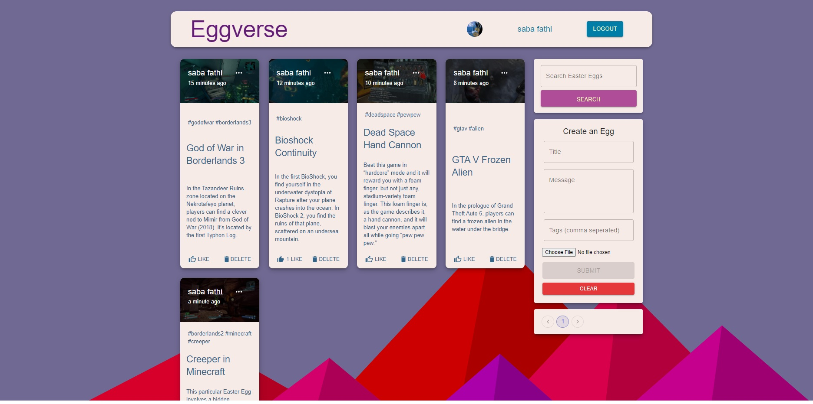
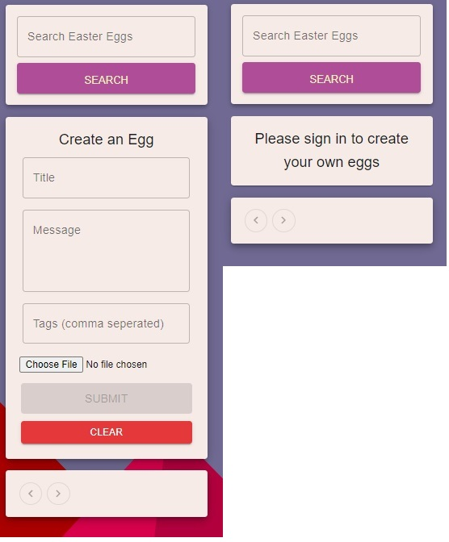
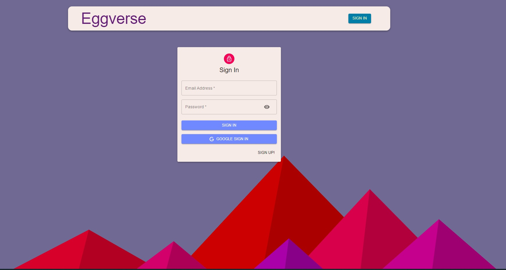
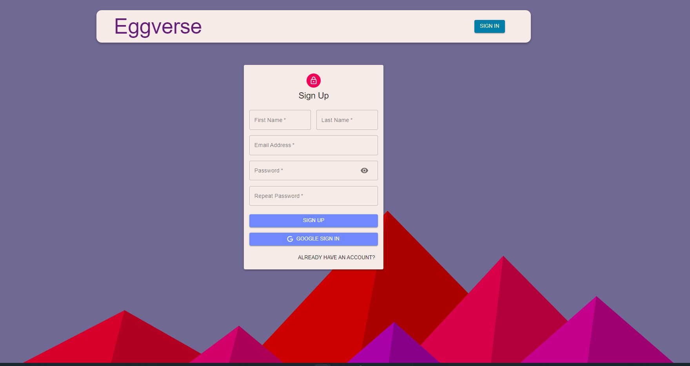
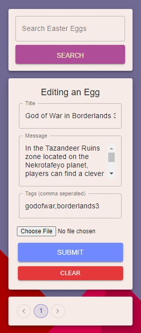
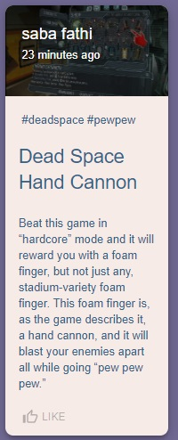
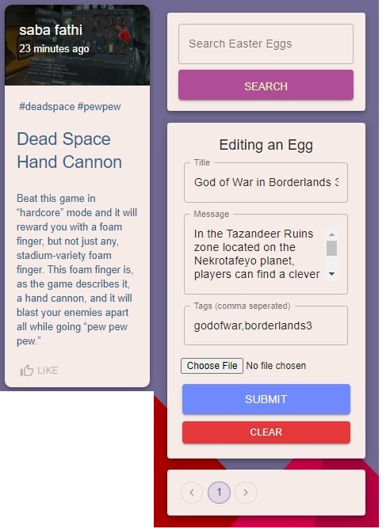

# Easter-Egg
### Full Stack MERN Project.

This is a website to post easter eggs found in video games. Using React, Redux, Node, Express, MongoDB.

### Home Page

The home page features a navbar that allows for the user to log in or sign up. In the center of the page all available posts are presented to the user.

On the right side of the page users are able to search for specific posts. Users with an account will be able to create posts using the form.

The Eggverse app also features pagination, which limits the number of posts on the screen to 8, users can iterate through pages to look at various posts.

### Login and Sign Up

The web app contains an OAuth implementation that lets users create an account through the app, or to log in using their google account. Their information is then displayed on the navbar.

Users that are logged in gain access to a few more features. They are able to create their own posts, like other peoples posts, and can edit or delete posts they have created.

### Create and Edit Posts

By using the form on the right, users can create and edit posts. The form uses a post title, small description, and some tags for social media purposes, they can also upload a picture that will be presented in the post.

### Posts

The posts presented on the home screen can be clicked on to view a single page version of the posts, which allows users to view the attached image in better quality and read the description the creator has provided.
